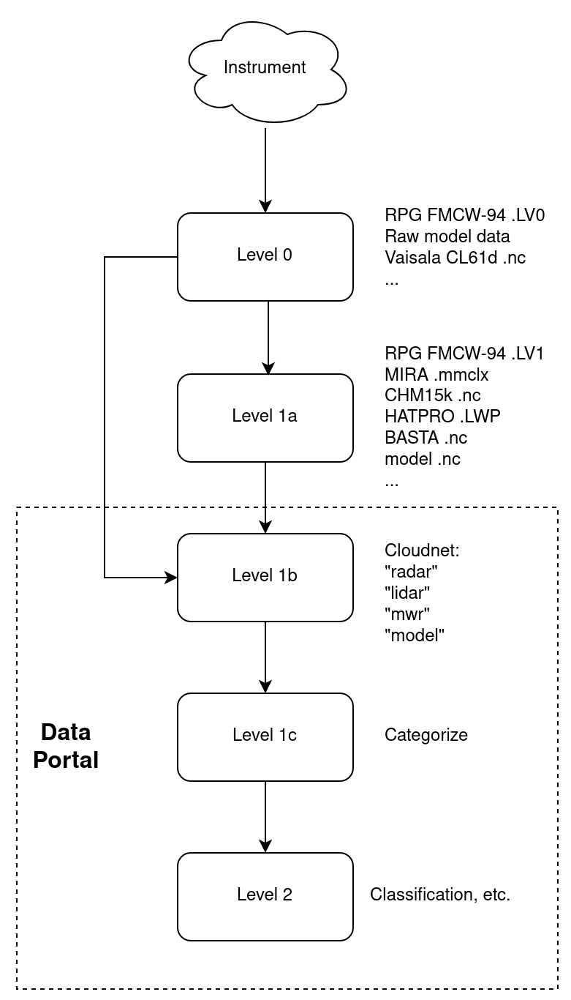

# Data levels

Cloudnet data comes as different data levels.

## Level 0  and Level 1a

Raw data is submitted as Level 0, which is as close to the raw output from the instrument as possible, 
or as Level 1a which are data minimally processed by the instrument or the uploading site.

Examples of Level 0 to Level 1 processing are noise screening (some data loss) 
and concatenation of several files to single daily file (no data loss).

## Level 1b

Level 1b files generally contain harmonized data and metadata. However, completely consistent 
files are impossible to provide because of large variety of different supported instruments.
For example, depending on the model, different cloud radars and ceilometers provide slightly 
different measured parameters.

## Level 1c

Level 1c file contains gridded measurement data with some derived auxiliary information like 
the wet bulb temperature and the amount of liquid attenuation.

## Level 2

Level 2 files contain derived quantities like the classification of the targets 
or ice water content.

