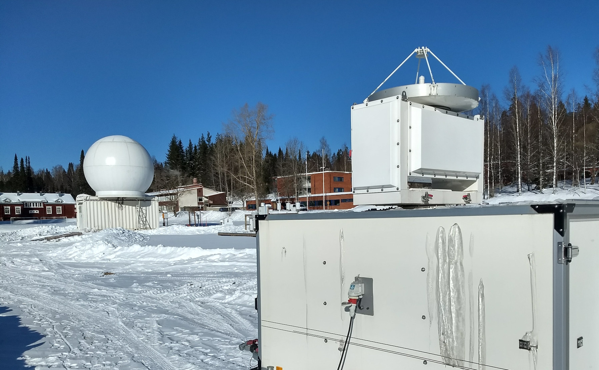

# Hyytiälä

Hyytiälä is a historical forestry station in Finland, operated by the
University of Helsinki. Hyytiälä hosts the [Station for Measuring
Ecosystem–Atmosphere Relations II](https://www.atm.helsinki.fi/smear/smear-ii/)
(SMEAR II), one of the world’s most comprehensive surface in situ observation
sites in a boreal forest environment. The instrumentation covers aerosol
dynamics, atmospheric chemistry, micrometeorology, weather monitoring, cloud
remote sensing and ecophysiology of trees growing in the urban environment.

The cloud remote observations in Hyytiälä have started in 2012. These
observations were carried out on campaign basis. In 2014, the second [ARM
Mobile Facility](https://www.arm.gov/capabilities/observatories/amf) (AMF2) was
deployed to Hyytiälä, as a part of Biogenic Aerosols–Effects on Clouds and
Climate experiment (Petäjä et al., 2016). Since then, continuous observations
of cloud and precipitation are carried out at the site.

The cloud profiling site is located on the lake Kuivajärvi shore. It is about
30 m below the base of the SMEAR II mast, where most aerosol measurments are
performed.

# Instrumentation

## Cloud remote sensing

- Doppler Cloud Radar: RPG-FMCW-94-DP (since December 2017)
- Doppler Radar: C-band radar (since August 2016)
- Doppler Cloud Radar: Metek MIRA-35 (on campaign basis)
- Lidar: Vaisala CL61 (since June 2021)
- Microwave radiometer: RPG HATPRO G5 (since June 2018)
  89 GHz, passive channel of RPG-FMCW-94-DP
- Doppler Lidar, Halo Photonics

## Precipitation sensors

- Disdrometer: OTT Parsive 2 (inside and outside of DFIR)
- Video Imager: NASA Precipitation Imaging Package (Pettersen et al.,2020; von Lerber et al., 2017)
- Precipitaion gauge: OTT Pluvio 200 (inside of DFIR) and OTT Pluvio 400 (outside of DFIR)
- Snow depth sensor: Jenoptik SHM30

## Contact person

- [Dmitri Moisseev](mailto:dmitri.moisseev@helsinki.fi)

## Links

- [Hyytiälä home page](https://www2.helsinki.fi/en/research-stations/hyytiala-forestry-field-station)

## References

Petäjä, T., E. O’Connor, D. Moisseev et al., 2016: BAECC: A Field Campaign to
Elucidate the Impact of Biogenic Aerosols on Clouds and Climate. Bull. Amer.
Meteor. Soc., 97, 1909–1928, doi: 10.1175/BAMS-D-14-00199.1.

Pettersen, C.; Bliven, L.F.; von Lerber, A.; Wood, N.B.; Kulie, M.S.; Mateling,
M.E.; Moisseev, D.N.; Munchak, S.J., Petersen, W.A.; Wolff, D.B., 2020: The
Precipitation Imaging Package: Assessment of Microphysical and Bulk
Characteristics of Snow. Atmosphere, 11, 785.
https://doi.org/10.3390/atmos11080785

von Lerber, A., D. Moisseev, L.F. Bliven, W. Petersen, A. Harri, and V.
Chandrasekar, 2017: Microphysical Properties of Snow and Their Link to Ze–S
Relations during BAECC 2014. J. Appl. Meteor. Climatol., 56, 1561–1582,
https://doi.org/10.1175/JAMC-D-16-0379.1

## Pictures

