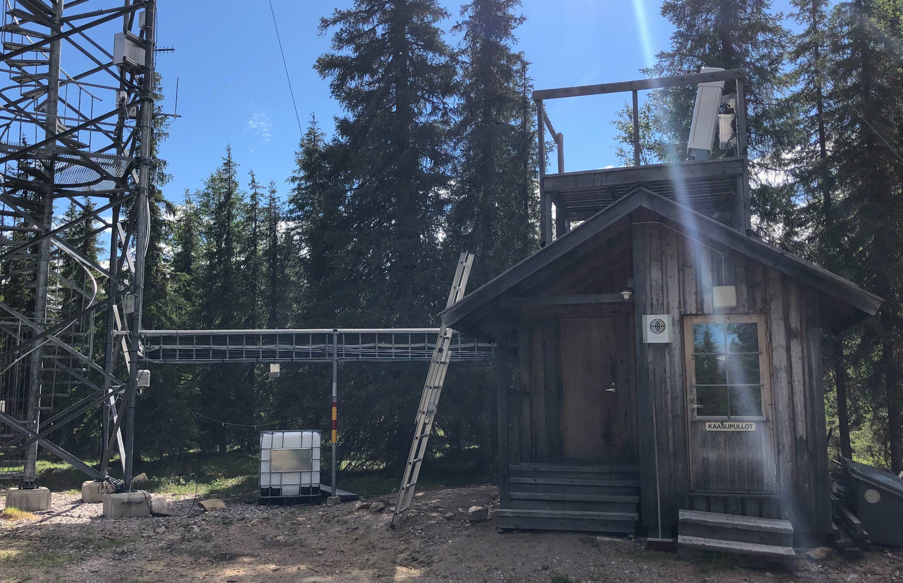

# Kenttärova

Kenttärova is a remote site in Northern Finland. It's a part of the [Pallas
Atmosphere-Ecosystem Supersite](https://en.ilmatieteenlaitos.fi/pallas-atmosphere-ecosystem-supersite)
hosted by the Finnish Meteorological Institute. The station was established in
2002 and features a 20-meter-high measurement tower for studying
atmosphere–biosphere interactions above a spruce forest (Lohila et al. 2015).
Cloud remote sensing measurements at the site started in 2022.

## References

- Lohila et al. (2015). Preface to the special issue on integrated research of
  atmosphere, ecosystems and environment at Pallas. _Boreal Environment
  Research_, _20_(4), 431–454. <https://hdl.handle.net/10138/228278>

## Contact person

- [Ewan O'Connor](mailto:ewan.oconnor@fmi.fi)

## Pictures

