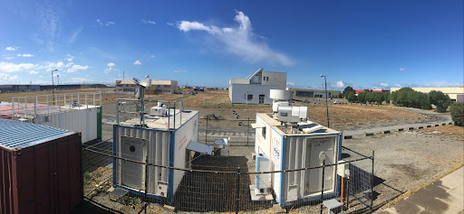
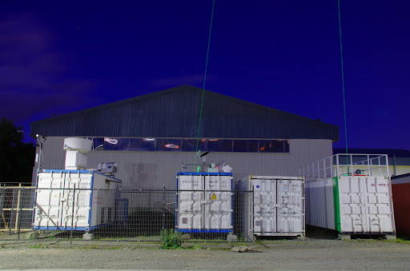

# Punta Arenas

The LACROS observational facility was deployed in Punta Arenas, Chile at the
southern tip of South America for a long-term campaign in the framework of the
field experiment [Dynamics, Aerosol, Clouds and Precipitation Observations in
the Pristine Environment of the Southern Ocean](https://dacapo.tropos.de/)
(DACAPO-PESO), a research initiative of Leibniz Institute for Tropospheric
Research, Leipzig, Germany in joint collaboration with the University of
Magallanes, Punta Arenas, Chile, and the University of Leipzig, Leipzig,
Germany.

The campaign location was in the premises of the University of Magallanes,
Punta Arenas, Chile.

## Instrumentation

The Leipzig Aerosol and Cloud Remote Observations System (LACROS) [Bühl et al.,
2012] is container-based system housing the following instruments used in
ACTRIS-Cloudnet processing.

- Cloud radar instrument: Mira-35, SLDR mode
- Lidar instrument: Jenoptik CHM15k-x
- Disdrometer: OTT Parsivel-2
- Microwave radiometer: HATPRO G2
- Model data: ECMWF

## Pictures

